# TANTRA — Full A-to-Z Programming Language & Secure Computing Ecosystem Blueprint

> **Project name:** Tantra  
> **Working identity:** Sanskrit-inspired, security-first, multi-platform programming language and developer ecosystem  
> **Primary goal:** એક જ modern languageમાંથી UI, application logic, backend, secure services, algorithms, AI/math workloads, automation, browser extensions અને general software બનાવવાની ક્ષમતા આપવી.  
> **Initial project constraint:** Open-source / free-to-build first; game engine development is explicitly out of scope for the initial project.  
> **Status:** Concept + architecture blueprint; implementation specifications must be finalized before production coding.

---

## 0. Executive Summary

**Tantra** એક નવી programming language અને તેના આસપાસનું developer ecosystem હશે. તેનો ઉદ્દેશ માત્ર નવી syntax બનાવવાનો નથી. મુખ્ય ઉદ્દેશ એ છે કે developerને અલગ-અલગ layers માટે HTML + CSS + JavaScript + TypeScript + UI framework + backend framework + security libraries જેવી અનેક technologies વચ્ચે સતત context-switching કરવાની જરૂર ઓછામાં ઓછી રહે.

Tantraનું architecture શરૂઆતથી નીચેના principles પર આધારિત રહેશે:

1. **Security by design** — security અંતે ઉમેરવાનું feature નહીં, language/compiler/runtime/package systemનું મૂળભૂત property.
2. **One language, multiple targets** — developer-facing language એક; compiler અલગ deployment targets માટે optimized output આપે.
3. **Web-first practicality** — શરૂઆતમાં browser/web deployment સરળ બને તે માટે WebAssembly અને interoperable web output મહત્વનું target.
4. **Native capability later** — mature થયા પછી native targets અને platform-specific integrations.
5. **Fast developer experience** — clean syntax, useful compiler errors, fast incremental builds અને predictable tooling.
6. **Low unnecessary runtime work** — compiler-assisted optimization; unnecessary UI updates, allocations, network calls અને runtime overhead ઘટાડવાના પ્રયત્નો.
7. **Strong typing + explicit effects/permissions** — dangerous capabilities explicit બનાવવી.
8. **AI and mathematics as first-class citizens** — vectors, matrices, tensors, automatic differentiation, numerical kernels વગેરે માટે language/runtime support.
9. **Sanskrit-inspired identity** — terminology/keywordsમાં સંસ્કૃતથી પ્રેરણા; પરંતુ grammar એવી હોવી જોઈએ કે compiler માટે deterministic, unambiguous અને developer માટે practical રહે.
10. **Proof over claims** — “world's most secure” અથવા “world's fastest” જેવા claims benchmarks, audits, reproducible tests અને public methodology વગર ન કરવા.

---

# 1. Vision

## 1.1 One-line vision

> **“Write software in Tantra once; compile it securely and efficiently for the target platform.”**

## 1.2 Long-term vision

Tantra માત્ર language compiler નહીં પરંતુ નીચેના components ધરાવતું ecosystem બનશે:

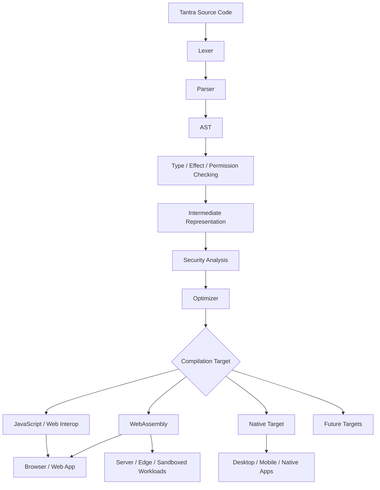

---

# 2. What Tantra IS and IS NOT

## 2.1 Tantra IS

- A programming language.
- A compiler toolchain.
- A runtime model.
- A standard library.
- A package/dependency ecosystem.
- A security model.
- A UI/declarative layer.
- An AI/math foundation.
- A developer toolchain.
- A documentation and testing ecosystem.
- A deployment/interoperability layer.

## 2.2 Tantra is NOT initially

- A game engine.
- A full 3D game engine.
- A replacement for every operating system.
- A replacement for every hardware driver.
- A guarantee of zero bugs.
- A guarantee of perfect security.
- A guarantee of zero latency or zero memory use.
- A requirement that every existing web technology must disappear on day one.

Game development can be supported later as an application area, but **building a first-party game engine is not part of the initial scope**.

---

# 3. Core Product Strategy

Tantra should not be built as “a Sanskrit-looking version of JavaScript.” It should have independent language semantics.

### Recommended layering

| Layer | Purpose | Initial priority |
|---|---|---:|
| Core language | Variables, functions, types, control flow, modules | P0 |
| Compiler | Source → IR → target | P0 |
| Type system | Safety and correctness | P0 |
| Security/effect system | Permissions, capabilities, effect tracking | P0 |
| Runtime | Memory, scheduling, async execution | P0 |
| Standard library | Common programming primitives | P0 |
| Web target | Browser deployment | P0 |
| UI DSL | UI structure + style + events | P1 |
| Package manager | Dependencies | P1 |
| Tooling | Formatter, linter, language server | P1 |
| Native target | Desktop/native apps | P2 |
| Mobile integration | Android/iOS packaging | P2 |
| AI/math | Numerical/ML foundation | P2 |
| Browser extensions | Extension SDK | P2 |
| Advanced formal verification | Proof-oriented security modules | P3 |
| Game framework | Community/third-party ecosystem | P3 / external |

P0 = foundational; P1 = first usable ecosystem; P2 = mature expansion; P3 = later/community scope.

---

# 4. Why One Language Instead of Many Frontend/Backend Languages?

Traditional web projects often combine several categories of technology:

```text
HTML        → document/UI structure
CSS         → styling
JavaScript  → behavior
TypeScript  → typed application code
React       → UI library
Vite        → build/development tool
Backend     → another framework/language
DB layer    → another query/API layer
Security    → several libraries/tools
```

Tantra's developer-facing model should instead look conceptually like:

```text
Tantra
│
├── UI
├── State
├── Networking
├── Data
├── Backend
├── Security
├── Async
├── Math / AI
└── Platform APIs
```

The important distinction is:

> **Tantra may internally use JavaScript, WebAssembly, native code or platform APIs, but those implementation details do not have to become the developer's daily programming language.**

---

# 5. Why a Compiler Is Needed

A compiler converts source written in Tantra into a lower-level form that a computer platform/runtime can execute.

### Conceptual pipeline

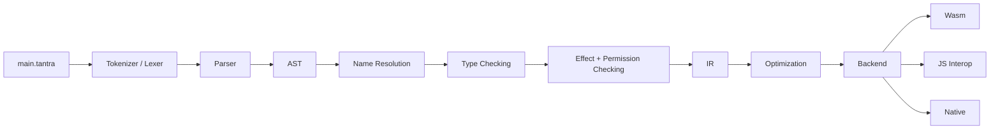

The compiler is **not merely a translator to React/HTML/CSS**.

It can compile directly to a lower-level target.

### Example

Developer code:

```text
પૃષ્ઠ "નમસ્તે"
    શીર્ષક "નમસ્તે વિશ્વ"
    બટન "પ્રારંભ કરો" પર દબાવો:
        સંદેશ બતાવો("શુભ દિવસ")
```

Possible internal stages:

```text
Tantra source
    ↓
AST
    ↓
UI IR
    ↓
Security/effect analysis
    ↓
Optimized UI graph
    ↓
Web runtime calls / Wasm / JS interop
```

React does not have to be part of this chain.

---

# 6. Language Name and Brand

## Official project name

**Tantra**

Potential long-form branding options (choose only after trademark/domain/package-name checks):

- Tantra Programming Language
- Tantra Language
- Tantra Systems
- Tantra Computing
- Tantra Secure Runtime

### Naming principle

The language can use Sanskrit-inspired terminology while retaining international usability.

### Recommended policy

- Official keywords may have a Sanskrit/Indian identity.
- ASCII-compatible spellings should exist where practical.
- Unicode identifiers may be supported only after carefully defining normalization, confusables and security rules.

**Security warning:** allowing arbitrary Unicode identifiers can create visually similar/confusable symbols. Tantra must define a strict normalization and confusable-detection policy.

---

# 7. Language Design Philosophy

## 7.1 Syntax goals

Syntax should be:

- readable
- deterministic
- consistent
- concise
- type-safe
- easy to parse
- friendly to autocomplete
- friendly to AI code generation
- safe with Unicode
- easy to format automatically

## 7.2 Sanskrit inspiration without parser ambiguity

Natural Sanskrit grammar is rich and flexible, but programming language parsers benefit from strict structure.

Therefore Tantra should **borrow terminology and conceptual inspiration**, not blindly copy natural-language grammar.

For example:

```text
જો x > 10 તો
    ...
અંત
```

is easier to parse reliably than requiring every sentence to obey natural Sanskrit case/agreement rules.

A later “Sanskrit literary mode” could be considered, but it should not compromise core compiler determinism.

---

# 8. Proposed Core Syntax (WORKING DRAFT)

> This section is intentionally provisional. Final syntax must be tested through prototype implementations and user feedback.

## 8.1 File extension

Candidate:

```text
.tantra
```

This should be checked against future ecosystem naming conflicts before final adoption.

## 8.2 Variables

Conceptual examples:

```text
સ્થિર સંખ્યા: પૂર્ણાંક = 10
બદલાય તેવી ગણતરી: પૂર્ણાંક = 0
```

Potential English/ASCII equivalent for tooling:

```text
const number: Int = 10
var count: Int = 0
```

A final design may support either one canonical syntax or a source-level Sanskrit mode + ASCII alias mode.

## 8.3 Functions

```text
કાર્ય ઉમેરો(a: પૂર્ણાંક, b: પૂર્ણાંક) -> પૂર્ણાંક {
    પરત a + b
}
```

## 8.4 Conditions

```text
જો ઉમર >= 18 {
    લખો("પાત્ર")
} નહીં તો {
    લખો("અપાત્ર")
}
```

## 8.5 Loops

```text
માટે દરેક item માં items {
    લખો(item)
}
```

## 8.6 Modules

```text
આયાત ગણિત
આયાત સુરક્ષા
આયાત ui
```

## 8.7 Error handling

Preferred model:

```text
પ્રયત્ન {
    પરિણામ = ડેટા મેળવો()
} ભૂલ err {
    નોંધો(err)
}
```

But for strongly typed code, a `Result<T, E>` style should be a core option.

---

# 9. Core Type System

The type system is one of Tantra's biggest security opportunities.

### Proposed built-in categories

| Category | Example |
|---|---|
| Boolean | true / false |
| Integer | Int8, Int16, Int32, Int64, UInt... |
| Floating point | Float32, Float64 |
| Decimal | Decimal (library/optional runtime support) |
| Character | Char |
| Text | String |
| Byte sequence | Bytes |
| Array | Array<T> |
| Map | Map<K,V> |
| Tuple | (A,B) |
| Option | Option<T> |
| Result | Result<T,E> |
| Struct/Record | user-defined |
| Enum | user-defined |
| Function | function types |
| Reference | controlled/safe references |
| Future/Async | Future<T> |
| Capability | permission-scoped handle |
| Tensor | numeric/AI layer |

### Type safety goals

- no implicit dangerous casts
- explicit conversion for security-sensitive types
- nullable values must be explicit
- resource ownership/lifetime rules where practical
- immutable-by-default option for critical data
- separate sensitive types for secrets/tokens/credentials

---

# 10. Memory Model

Memory safety should be a fundamental design choice.

### Candidate strategy

Use safe managed/ownership-aware memory semantics by default.

Possible approaches to evaluate:

1. Ownership/borrowing inspired model.
2. Garbage collection.
3. Reference-counted subsystems.
4. Hybrid managed runtime.
5. Unsafe escape hatch isolated behind explicit capability and audit markers.

### Recommended principle

```text
Safe by default
        ↓
Restricted unsafe mode
        ↓
Explicit annotation + compiler warning/error
        ↓
Optional audited boundary
```

Unsafe operations must never silently enter ordinary code.

---

# 11. Concurrency and Async Model

Tantra should avoid making every developer reason manually about low-level thread hazards.

Possible model:

```text
कार्य async ...
await ...
```

Underneath:

```text
Async runtime
   ↓
Scheduler
   ↓
Tasks / fibers / worker threads
```

Security goals:

- data-race reduction
- immutable/shared-state discipline
- explicit mutable shared memory
- structured concurrency
- cancellation propagation

---

# 12. Security Architecture — Core Principle

Tantra should **not** promise absolute security.

No language can guarantee that all software written in it will contain zero vulnerabilities.

Instead, Tantra will aim for **measurably strong security properties**.

### Security layers

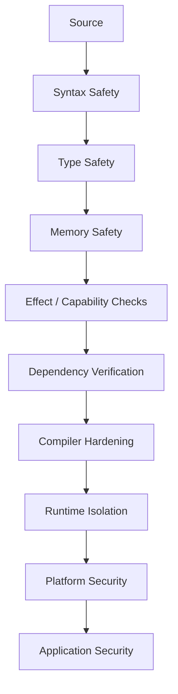

---

# 13. Security Threat Model

Before writing security features, define what Tantra protects against.

## Threat categories

| Threat | Tantra response |
|---|---|
| Memory corruption | Safe memory model |
| Type confusion | Strong type checking |
| XSS-like injection | Safe UI/text APIs |
| SQL injection | Typed/parameterized DB APIs |
| Secret leakage | Secret types + redaction |
| Supply-chain attack | Signed/hashed packages |
| Dependency confusion | Verified namespaces/registries |
| Privilege escalation | Capability permissions |
| Unsafe filesystem access | Explicit file capabilities |
| Network abuse | Explicit network capabilities |
| Malicious package | Sandbox + permission review |
| Unicode confusables | Identifier restrictions |
| Build tampering | Reproducible builds + artifact verification |
| Runtime escape | Sandboxing/isolation where target supports it |
| API misuse | typed wrappers + lint/security rules |

---

# 14. Capability / Permission System

A key Tantra feature should be capability-based security.

Example:

```text
કાર્ય download()
    ક્ષમતા network.read
{
    ...
}
```

A function should not gain filesystem/network/camera/microphone access merely because those APIs exist.

Conceptual permissions:

```text
network.read
network.write
filesystem.read
filesystem.write
process.spawn
crypto.use
camera.read
microphone.read
location.read
clipboard.read
clipboard.write
secrets.read
```

Applications declare required capabilities.

---

# 15. Secret Management

Sensitive values should have dedicated APIs/types.

Examples:

```text
Secret<String>
ApiKey
AccessToken
PrivateKey
```

Security goals:

- minimize accidental logging
- prevent ordinary string concatenation when possible
- redacted display
- explicit unwrap/access
- zeroization where practical

Tantra must never claim that zeroization is guaranteed across every compiler/runtime/platform; it should document platform-specific limits.

---

# 16. Package and Supply-Chain Security

This is mandatory for a mature language ecosystem.

### Required mechanisms

- package names/namespaces
- package metadata
- exact dependency versions
- lock file
- integrity hashes
- signed releases
- provenance metadata
- reproducible builds
- dependency audit
- security advisories
- yanked/blocked package mechanism
- permissions manifest
- trusted publisher concept

Conceptual flow:

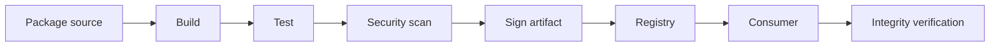

---

# 17. Compiler Architecture

## 17.1 Components

```text
Compiler Frontend
├── Lexer
├── Parser
├── AST
├── Symbol table
├── Name resolution
├── Type checker
├── Effect checker
├── Capability checker
└── Diagnostics

Middle End
├── Typed IR
├── Optimization passes
├── Escape analysis
├── Data-flow analysis
├── Security analysis
└── Code generation preparation

Backend
├── WebAssembly backend
├── JavaScript interop backend
├── Native backend (later)
└── Other targets (future)
```

---

# 18. Compiler Bootstrap Strategy

The first Tantra compiler cannot be written in Tantra because Tantra does not exist yet.

Therefore:

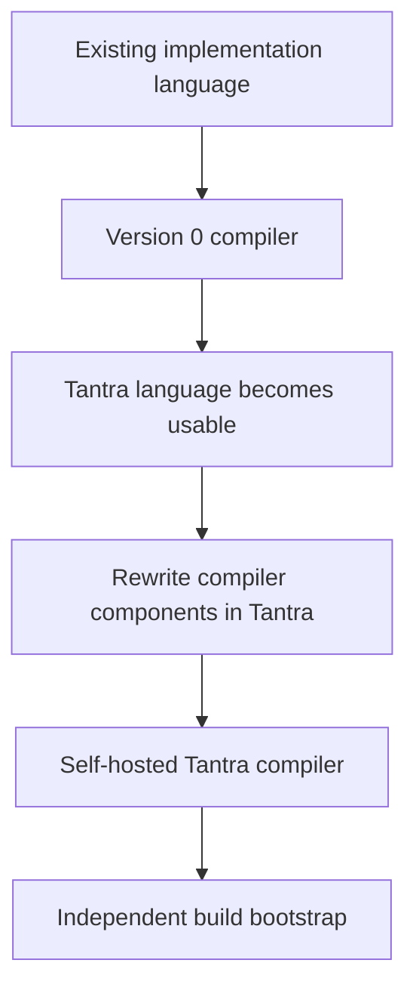

Candidate bootstrap languages can include Rust, C++, or another suitable systems language. The final selection should be made based on:

- safety
- tooling
- compiler ecosystem
- cross-platform support
- build speed
- team familiarity
- long-term maintainability

Rust is a strong candidate, but this blueprint intentionally does not lock the project to a single implementation language before benchmarking and prototyping.

---

# 19. Intermediate Representation (IR)

A dedicated IR is highly recommended.

Why?

Because direct source → every platform quickly becomes unmanageable.

Instead:

```text
Tantra source
       ↓
Tantra AST
       ↓
Typed IR
       ↓
Security-aware IR
       ↓
Optimization IR
       ↓
Target backend
```

Benefits:

- multiple targets
- reusable optimizer
- easier static analysis
- security checks before backend lowering
- better compiler architecture

---

# 20. Web Strategy

Tantra web development should have two levels.

## Level 1 — Interoperability

Initially integrate with existing browser APIs and JavaScript where necessary.

```text
Tantra
  ↓
Wasm + JS bridge
  ↓
Browser APIs
```

## Level 2 — First-class Tantra UI

Later, provide native Tantra UI primitives:

```text
Tantra UI
├── Component
├── State
├── Event
├── Layout
├── Style
├── Animation (optional later)
├── Accessibility
└── Browser bridge
```

### Goal

Developer should not need to know React in order to build a Tantra app.

However, React interop may remain available for migration and ecosystem compatibility.

---

# 21. UI System

## 21.1 Why not simply generate HTML + CSS?

Generating HTML/CSS can be useful, but a more advanced system can represent UI semantically.

Possible model:

```text
UI declaration
    ↓
UI AST
    ↓
Layout/style analysis
    ↓
Accessibility checks
    ↓
DOM/Wasm/browser runtime
```

## 21.2 Style system

Tantra can have a first-class style system inspired by CSS but designed around typed values:

```text
પ્રস্থ = 100%
અંતર = 16px
ફોન્ટ કદ = 20px
```

The actual syntax remains provisional.

## 21.3 Accessibility

UI compiler should detect or warn about:

- missing labels
- insufficient focus handling
- invalid interactive nesting
- keyboard accessibility gaps
- text alternatives where applicable

Accessibility is part of quality, not merely visual styling.

---

# 22. Backend / Server Model

Tantra server code should use the same core language.

Conceptual example:

```text
route GET "/users" {
    સુરક્ષા તપાસો
    users મેળવો
    JSONમાં પરત કરો
}
```

Features:

- HTTP server APIs
- routing
- request/response types
- authentication interfaces
- authorization policies
- database interfaces
- background tasks
- logging
- metrics
- configuration

---

# 23. Database Security

Recommended principles:

- parameterized queries by default
- typed query layers
- transaction support
- least-privilege connections
- secret isolation
- migration tooling
- audit logging hooks

Possible architecture:

```text
Tantra Application
       ↓
Typed DB API
       ↓
Driver/Adapter
       ↓
Database
```

---

# 24. Networking

Core APIs should support:

- HTTP/HTTPS
- WebSocket
- streaming
- DNS through safe APIs
- TLS via audited libraries/runtime integrations

Security features:

- certificate verification by default
- explicit insecure mode, never silent
- request timeout defaults
- size limits
- cancellation
- safe URL parsing

---

# 25. AI / Machine Learning Foundation

Games are not a first-party goal, but AI/math is in scope.

Tantra's AI layer can eventually provide:

- vector
- matrix
- tensor
- automatic differentiation
- numerical kernels
- linear algebra
- probability distributions
- optimization algorithms
- model serialization
- CPU/GPU/accelerator backends

Architecture:

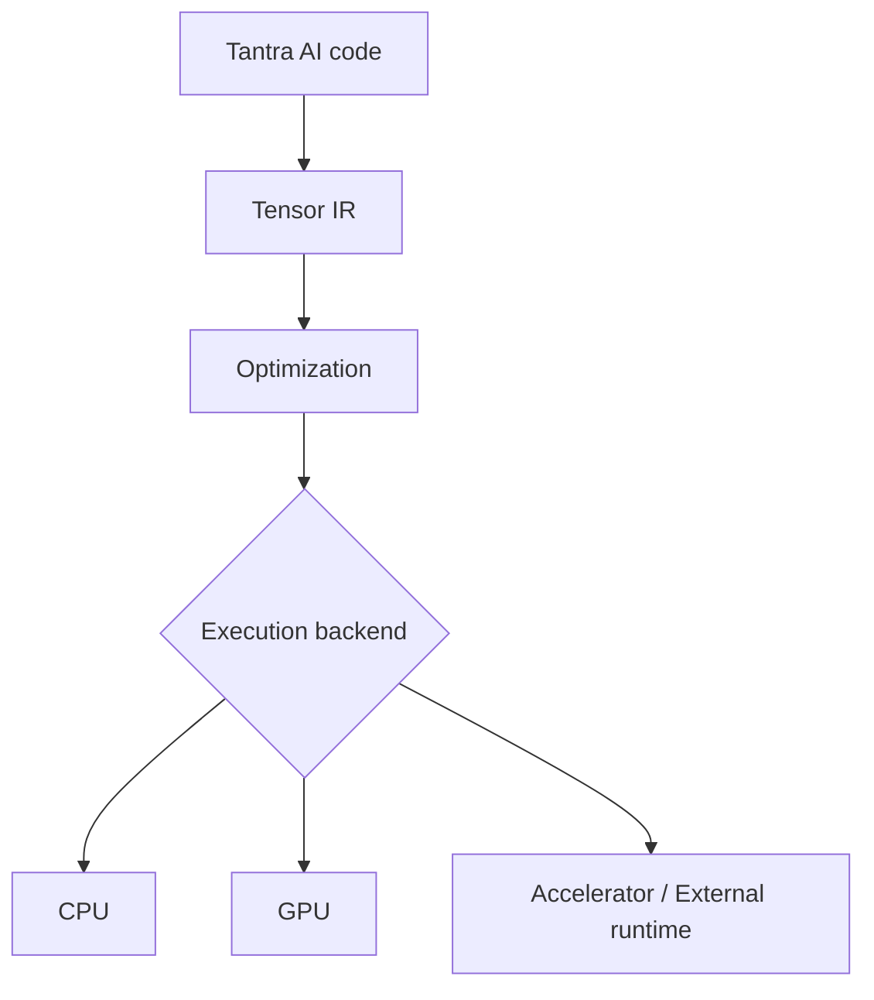

Important distinction:

> Tantra can make AI implementation easier and safer, but it does not magically create better intelligence. Model architecture, data, algorithms and hardware still matter.

---

# 26. Artificial Neuron Example

Conceptually:

```text
નેયુરોન(x, w, b)
    → activation(વેક્ટર ગુણાકાર(x, w) + b)
```

A future standard AI module could offer strongly typed tensor operations.

Possible safety checks:

- shape compatibility
- numeric overflow policies
- device compatibility
- memory limits
- deterministic mode where possible

---

# 27. Mathematical Computing

A serious math layer should include:

- integer arithmetic
- floating-point arithmetic
- arbitrary precision option
- complex numbers
- vectors
- matrices
- tensors
- statistics
- probability
- numerical methods
- symbolic math as optional later module

The math system should expose numerical precision and error characteristics explicitly.

---

# 28. Browser Extensions

Tantra can target browser extensions after the core web target is stable.

```text
Tantra
   ↓
Extension SDK
   ↓
Manifest generation
   ↓
Wasm/JS bridge
   ↓
Browser extension package
```

The SDK should provide typed wrappers for:

- storage
- tabs
- messages
- content scripts
- service workers
- permissions

Security should be least-privilege by default.

---

# 29. Desktop / Mobile Application Strategy

Do not start by building a huge cross-platform UI toolkit.

Recommended evolution:

### Stage A
Web + Wasm.

### Stage B
Desktop wrapper/native bindings.

### Stage C
Native platform bindings.

### Stage D
First-class cross-platform application framework.

Possible targets:

```text
Windows
macOS
Linux
Android
iOS
```

Platform-specific APIs remain wrapped behind safe capability boundaries.

---

# 30. Game Scope Decision

**Official initial scope:** no first-party game engine.

Why?

A game engine alone is a massive product including:

- rendering
- physics
- audio
- asset pipelines
- scene graphs
- animation
- input
- tooling
- editor
- shaders
- GPU abstraction

Adding this to the first version of Tantra would dilute the core goal.

### Future position

Third-party developers may use Tantra to build games if the language/runtime is suitable. A community game framework can appear later without making game development a first-party requirement.

---

# 31. Developer Toolchain

Tantra should eventually have:

```text
તાંત્રા CLI
├── new
├── build
├── run
├── test
├── format
├── lint
├── check
├── security
├── package
├── publish
├── docs
└── doctor
```

Example concept:

```text
tantra new my_app
tantra check
tantra test
tantra build --target web
tantra security scan
tantra run
```

---

# 32. Language Server / IDE Support

A full developer experience needs a Language Server Protocol implementation.

Features:

- autocomplete
- go to definition
- find references
- rename symbol
- inline diagnostics
- hover documentation
- code actions
- formatting
- refactoring

Initial editor target can be VS Code.

Later:

- JetBrains
- Neovim
- Zed
- browser playground

---

# 33. Formatting and Linting

Tantra should ship an official formatter.

Principle:

> One official formatting style prevents ecosystem fragmentation.

Security linter categories:

- unsafe capability usage
- secret logging
- insecure network option
- unchecked external input
- unsafe deserialization
- dangerous process execution
- suspicious Unicode identifiers
- insecure randomness
- weak cryptographic primitive usage

---

# 34. Error Messages

Compiler diagnostics are a major language-quality differentiator.

A good message should show:

```text
What happened
Why it happened
Where it happened
How to fix it
Security impact (if applicable)
```

Example concept:

```text
ERROR T1024
ક્ષમતા 'filesystem.write' ઉપલબ્ધ નથી.

કાર્ય: report.save()
ફાઇલ: reports.tantra
પંક્તિ: 27

કારણ:
આ module પાસે filesystem.write capability declare કરેલી નથી.

ઉકેલ:
1. capability explicitly ઉમેરો, અથવા
2. write operation દૂર કરો.
```

---

# 35. Standard Library

Initial standard library candidates:

```text
core
collections
text
math
time
random
crypto
encoding
json
http
websocket
filesystem
process
concurrency
async
security
logging
testing
serialization
```

The standard library should prefer safe APIs.

---

# 36. Serialization

Need safe, versioned serializers.

Supported formats:

- JSON
- binary format
- optionally CBOR/MessagePack-like interoperability
- custom typed schema format later

Deserialization should protect against:

- resource exhaustion
- type confusion
- unexpected recursion
- oversized payloads

---

# 37. Cryptography

Tantra must not invent new cryptographic algorithms merely because the language is new.

Instead:

> **Use widely reviewed cryptographic primitives through audited libraries/backends, expose safe high-level APIs, and keep raw/low-level access restricted.**

The language itself should make secure patterns easy.

---

# 38. Randomness

Distinguish:

```text
PseudoRandom
SecureRandom
```

Security-sensitive APIs must never silently fall back to insecure randomness.

---

# 39. Testing Strategy

Tantra must be tested at many levels.

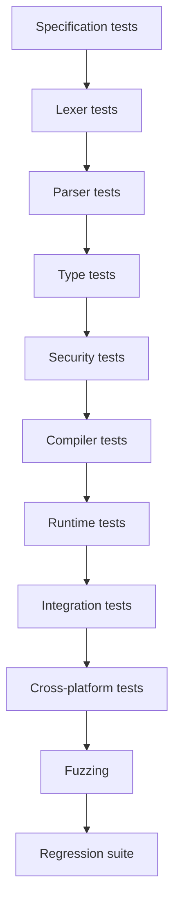

## Mandatory testing categories

- unit tests
- parser golden tests
- compiler correctness tests
- property-based tests
- fuzz tests
- differential tests
- security regression tests
- package manager tests
- performance benchmarks
- reproducibility tests
- compatibility tests

---

# 40. Fuzz Testing

Compiler/parser/runtime software should be heavily fuzzed.

Targets:

- lexer
- parser
- formatter
- decoder
- package manifest reader
- compiler optimization passes
- network parsers
- serialization

Goal:

Find crashes, hangs, malformed behavior, panics and unexpected memory consumption.

---

# 41. Formal Methods / Verification Roadmap

Not every part of Tantra needs formal proof.

However, security-critical components can gradually adopt:

- formal specifications
- model checking
- verified invariants
- memory safety proofs where practical
- parser correctness proofs for critical subsets

This is **Phase 3+**, not a Phase 1 requirement.

---

# 42. Performance Strategy

Tantra should measure rather than advertise performance.

### Benchmark groups

| Benchmark | Metric |
|---|---|
| startup | milliseconds |
| compile | seconds |
| memory | MB / allocation count |
| HTTP | requests/sec + latency |
| UI | frame/update cost |
| numeric | operations/sec |
| serialization | MB/s |
| Wasm | execution throughput |
| native | target-specific throughput |

### Optimization priorities

1. Correctness
2. Security
3. Predictability
4. Compile performance
5. Runtime performance
6. Binary size

Avoid premature optimization that weakens security or maintainability.

---

# 43. UI Performance Philosophy

The goal is not “no lag ever.”

The goal is:

> **Minimize unnecessary work and make expensive work visible, measurable and optimizable.**

Possible techniques:

- incremental compilation
- incremental UI updates
- static analysis
- memoization where safe
- lazy loading
- code splitting
- allocation reduction
- batching
- asynchronous scheduling
- compiler-assisted rendering optimization

---

# 44. JavaScript / Existing Ecosystem Interoperability

Tantra should not isolate itself from the world.

Need interoperability with:

- JavaScript APIs
- Web APIs
- existing npm packages where technically feasible
- C ABI / native libraries later
- WebAssembly modules
- HTTP services
- database drivers

### Principle

```text
Tantra-native by default
Interoperable by design
```

---

# 45. Package Manager and Registry

Possible architecture:

```text
Developer
   ↓
tantra add package
   ↓
Registry lookup
   ↓
Signature verification
   ↓
Hash verification
   ↓
Permission inspection
   ↓
Download
   ↓
Lock file update
```

Registry can be hosted later using open infrastructure. It does not need to exist on day one.

---

# 46. GitHub Integration

GitHub's role:

```text
Source code
Compiler
Tests
Docs
Releases
Issues
Discussions
Security advisories
CI/CD
```

A mature Tantra project should have multiple repositories or a monorepo depending on maintainability.

### Suggested initial repository layout

```text
Tantra/
├── compiler/
├── lexer/
├── parser/
├── ir/
├── runtime/
├── stdlib/
├── ui/
├── security/
├── cli/
├── formatter/
├── linter/
├── language-server/
├── package-manager/
├── docs/
├── examples/
├── tests/
├── benchmarks/
├── specs/
├── rfcs/
├── tools/
├── website/
├── CONTRIBUTING.md
├── SECURITY.md
├── LICENSE
├── README.md
└── roadmap.md
```

### GitHub language recognition

Eventually we can provide syntax grammar and ecosystem metadata so `.tantra` files get proper code highlighting and developer tooling. Exact GitHub implementation details should be revalidated against current platform documentation when the repository is ready.

---

# 47. Vercel Deployment Architecture

Vercel does not need to become the Tantra compiler itself.

Recommended deployment model:

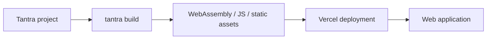

A future framework integration can provide a standard build command and output layout.

For server/edge deployment, target-specific adapters can be added later.

---

# 48. Domain Strategy

Do **not** buy a domain before the brand is finalized and availability is verified.

Later, check:

- domain availability
- trademark conflicts
- package registry name
- GitHub organization name
- social handles
- pronunciation
- international meaning

Possible domains are examples only and must be checked at the time of purchase.

---

# 49. Infrastructure and Hardware Plan

## Phase 1: normal development

A normal modern laptop/desktop is enough.

Recommended starting range:

- 16 GB RAM preferred
- SSD
- modern multi-core CPU
- stable Linux/Windows/macOS environment

A dedicated GPU is not required for compiler development.

## Phase 2: heavier testing

Use:

- CI runners
- cloud compute
- rented GPU/CPU instances when needed

## Phase 3: large-scale AI/research

Only if Tantra's AI ecosystem itself starts training large models should specialized compute become a major expense.

### Key principle

> **Building a programming language is not the same as training a giant AI model.**

Therefore owning very expensive computers is not a prerequisite for the project.

---

# 50. Cost Strategy — Free-First Model

## Can the project start at ₹0?

Yes, development can begin with free/open-source tools and existing hardware.

Possible free/open tools:

- GitHub repositories
- open-source compiler infrastructure
- VS Code
- local build tools
- free documentation hosting
- free-tier deployment where suitable
- open-source CI where available

### Future costs may include

- domain name
- paid CI minutes if scale grows
- package registry hosting
- cloud compute
- large artifact storage
- security audits
- legal/trademark work
- paid infrastructure

The goal is not “zero cost forever”; the goal is **zero/low-cost until real usage requires scale**.

---

# 51. Open Source Strategy

Recommended license decision should happen before public release.

Candidates to evaluate:

- Apache-2.0
- MIT
- BSD-style licenses
- GPL-family licenses where appropriate
- dual licensing only if there is a clear business/legal reason

Do not copy code from projects whose licenses are incompatible with the planned license.

---

# 52. Governance

Once public, Tantra needs a governance model.

Possible structure:

```text
Tantra Foundation / Maintainers
│
├── Language design
├── Compiler
├── Security
├── Runtime
├── Web/UI
├── Tooling
└── Community
```

Use an RFC process for major language changes.

Every language-breaking change must have:

- motivation
- specification
- security impact
- migration path
- implementation plan
- test plan

---

# 53. RFC System

Example:

```text
RFC-0001: Module system
RFC-0002: Type system
RFC-0003: Capability model
RFC-0004: UI syntax
RFC-0005: Error model
RFC-0006: Package format
```

No major feature should enter the core merely because it “looks nice.”

---

# 54. Documentation Strategy

Documentation should exist at multiple levels.

### Beginner

- Install Tantra
- Hello World
- variables
- functions
- conditions
- UI

### Intermediate

- modules
- async
- networking
- database
- security

### Advanced

- compiler internals
- IR
- runtime
- memory model
- capability model
- package security

### Research

- formal semantics
- optimization papers
- benchmark methodology
- security model

---

# 55. Online Playground

A browser-based playground is extremely valuable for adoption.

Architecture:

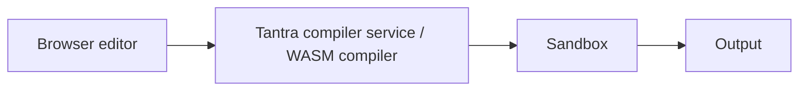

Security requirement:

Untrusted code must run inside a sandbox with strong resource limits.

No arbitrary filesystem, network, process spawning or secret access.

---

# 56. Security Scanner

Tantra CLI should eventually support:

```text
tantra security scan
```

Possible checks:

- dependency vulnerabilities
- dangerous capabilities
- insecure API use
- weak crypto
- secret leakage patterns
- suspicious Unicode
- unsafe deserialization
- excessive permissions
- unpinned dependencies
- package signature failures

---

# 57. Reproducible Builds

A key mature-project objective:

> Same source + same declared dependencies + same compiler version should produce verifiably equivalent artifacts, subject to documented platform/toolchain conditions.

This enables stronger supply-chain trust.

Required components:

- lock file
- compiler version pinning
- dependency hashes
- deterministic build settings where possible
- build metadata
- signed artifacts

---

# 58. Security Audit Roadmap

No security claim should be based only on “the compiler checks it.”

Audit stages:

```text
Internal tests
      ↓
Fuzzing
      ↓
Static analysis
      ↓
Dependency audit
      ↓
Independent code review
      ↓
External security audit
      ↓
Public vulnerability program
```

---

# 59. Vulnerability Disclosure

Create:

```text
SECURITY.md
```

Include:

- reporting method
- supported versions
- severity policy
- response expectations
- disclosure process
- CVE coordination if appropriate

Never encourage public exploit details before a fix is available for responsibly disclosed vulnerabilities.

---

# 60. Privacy Philosophy

Tantra tooling should support privacy-first defaults where practical.

Examples:

- no telemetry by default
- opt-in diagnostics sharing
- local builds by default
- no upload of source code unless user explicitly enables cloud services
- package registry communications clearly documented
- transparent network calls

A `tantra doctor` or `tantra network-report` command can eventually explain what the CLI connects to.

---

# 61. Build Modes

Recommended modes:

```text
Development
Release
Secure
Debug
Size-optimized
Performance-optimized
Reproducible
```

A **Secure Build** could enable stricter checks, but security should never depend solely on a special build mode.

---

# 62. Release Channels

Suggested:

```text
Nightly
Alpha
Beta
Stable
LTS (later)
```

Nightly is for experimentation, not production security guarantees.

---

# 63. Backward Compatibility

Language evolution rules:

- semantic versioning for package APIs where appropriate
- explicit breaking-change releases
- migration tooling
- deprecation warnings
- long enough transition period

---

# 64. AI-Assisted Development

AI can help build Tantra faster, but all AI-generated compiler/security code must be reviewed and tested.

Recommended workflow:

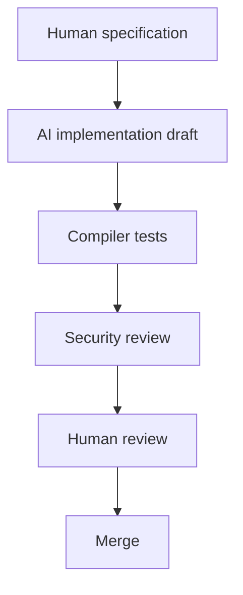

AI must not be treated as proof of correctness.

---

# 65. Multi-Agent Development Strategy

For a large AI-assisted project, agents can be divided by domain:

```text
Agent 1  → Language specification
Agent 2  → Lexer
Agent 3  → Parser
Agent 4  → Type system
Agent 5  → IR
Agent 6  → Compiler backend
Agent 7  → Security
Agent 8  → Runtime
Agent 9  → UI
Agent 10 → AI/math
Agent 11 → Package manager
Agent 12 → Tooling
Agent 13 → Testing/fuzzing
Agent 14 → Documentation
Agent 15 → Release engineering
```

However, agent count should be dynamic and based on actual work, not inflated merely for appearance.

A central integration/audit agent or maintainer should reconcile all changes.

---

# 66. Repository Strategy

### Option A — Monorepo (recommended initially)

Everything in one repository.

Benefits:

- easier synchronized changes
- easier global testing
- simpler versioning
- easier AI-assisted work

### Option B — Multi-repo later

Split stable components when organizational scale requires it.

---

# 67. First Repository Layout (Detailed)

```text
Tantra/
├── docs/
│   ├── language-spec/
│   ├── security/
│   ├── compiler/
│   ├── runtime/
│   └── tutorials/
│
├── specs/
├── rfcs/
├── compiler/
│   ├── lexer/
│   ├── parser/
│   ├── ast/
│   ├── resolver/
│   ├── typecheck/
│   ├── effects/
│   ├── ir/
│   ├── optimizer/
│   └── backends/
│
├── runtime/
├── stdlib/
├── ui/
├── security/
├── cli/
├── formatter/
├── linter/
├── lsp/
├── package-manager/
├── package-registry/
├── playground/
├── examples/
├── tests/
│   ├── unit/
│   ├── integration/
│   ├── security/
│   ├── fuzz/
│   └── conformance/
├── benchmarks/
├── scripts/
├── website/
├── LICENSE
├── README.md
├── CONTRIBUTING.md
├── CODE_OF_CONDUCT.md
├── SECURITY.md
└── ROADMAP.md
```

---

# 68. Development Phases

## Phase 0 — Research and Specification

Deliverables:

- language goals
- syntax RFC
- type system
- security model
- target strategy
- project license
- repository plan

No giant implementation yet.

## Phase 1 — Minimal Compiler

Build:

- lexer
- parser
- AST
- basic type checker
- interpreter or basic code generator
- CLI

Goal:

```text
Hello World
variables
functions
conditions
loops
```

## Phase 2 — Safe Core

Add:

- stronger types
- error model
- memory model
- capability model
- module system
- standard library foundations

## Phase 3 — Web Target

Add:

- Wasm backend
- JS interop
- browser runtime
- basic UI DSL
- web build command

## Phase 4 — Developer Ecosystem

Add:

- formatter
- linter
- LSP
- VS Code extension
- package manager
- documentation generator

## Phase 5 — Security Hardening

Add:

- fuzzing infrastructure
- dependency signing
- reproducible builds
- security scanner
- audit process

## Phase 6 — Backend / Services

Add:

- HTTP
- databases
- auth primitives
- background jobs
- deployment adapters

## Phase 7 — AI/Math

Add:

- tensors
- autodiff
- numerical kernels
- AI interoperability

## Phase 8 — Native / Mobile

Add:

- native backend
- platform adapters
- desktop/mobile packaging

## Phase 9 — Self-hosting

Rewrite enough compiler infrastructure in Tantra to produce a self-hosted build.

---

# 69. Timeline Estimate

These are planning ranges, not promises.

| Milestone | Approx. effort |
|---|---:|
| language concept/spec draft | 2–6 weeks |
| minimal prototype | 1–3 months |
| usable core language | 3–9 months |
| useful web target | 6–12+ months |
| security + package foundation | 9–18+ months |
| broader ecosystem | 12–24+ months |
| mature multi-platform ecosystem | 2–5+ years |
| highly mature self-hosted ecosystem | potentially 3–7+ years |

The time can be much shorter for a prototype and much longer for a robust production ecosystem.

---

# 70. Team Size Guidance

## One person + AI assistance

Can realistically build:

- language prototype
- basic compiler
- documentation
- early tooling

## Small team

Better for:

- production compiler
- runtime
- security
- web ecosystem

## Larger team

Needed only as the project becomes a serious ecosystem.

The language can begin small and evolve.

---

# 71. What We Should NOT Build First

Do not begin with:

- giant AI training infrastructure
- massive package registry
- native compiler for every OS
- game engine
- 3D editor
- custom operating system
- custom database
- custom cryptographic algorithms
- hundreds of built-in libraries
- huge website
- marketing before the compiler works

The first objective is a correct, understandable, testable core.

---

# 72. First Minimum Viable Tantra (MVT)

The first usable Tantra should support only:

```text
1. variables
2. primitive types
3. functions
4. conditions
5. loops
6. collections
7. errors
8. modules
9. standard output
10. CLI
11. basic compiler/interpreter
12. unit tests
```

Then add:

```text
13. type checker
14. capability model
15. Wasm backend
16. basic web output
```

This keeps the project manageable.

---

# 73. Example End-to-End Project

Hypothetical Tantra project:

```text
myapp/
├── main.tantra
├── ui.tantra
├── server.tantra
├── security.tantra
├── package.tantra
└── tantra.lock
```

Developer runs:

```text
tantra check
tantra test
tantra security scan
tantra build --target web
```

Output:

```text
build/
├── app.wasm
├── web-bridge.js
├── assets/
└── index.html
```

The `index.html` here is generated deployment infrastructure, not necessarily something the developer has to author manually.

---

# 74. Why WebAssembly Is Important

WebAssembly is a practical compilation target for portable, sandbox-oriented execution.

Tantra should evaluate Wasm early because it can reduce the need to generate multiple completely different machine-code backends at the beginning.

However:

> Wasm is a target, not the entire language architecture.

Tantra still needs its own language semantics, type system, security model and tooling.

---

# 75. Native Backend Strategy

Do not build every native code generator from scratch.

Possible approaches:

1. Target an established compiler infrastructure.
2. Lower Tantra IR to a mature backend.
3. Add platform-specific code generation later.

This reduces initial engineering complexity.

---

# 76. Security vs Performance Trade-off Policy

A critical governance rule:

> No performance feature may silently weaken a documented security guarantee.

Any unsafe optimization should require explicit specification and review.

Document trade-offs openly.

---

# 77. Security Scorecard

Instead of an arbitrary “A1++++” rating, create an evidence-based scorecard.

Example categories:

| Category | Measurement |
|---|---|
| Memory safety | known violation count + test coverage |
| Unsafe APIs | percentage of explicit/isolated unsafe boundaries |
| Capability security | unauthorized capability test suite |
| Dependency integrity | signature/hash coverage |
| Build reproducibility | reproducible build rate |
| Fuzzing | execution corpus + crash rate |
| Static security checks | rule coverage |
| Runtime isolation | escape test results |
| Vulnerability response | disclosure/fix metrics |
| Supply-chain hardening | provenance verification coverage |

The actual scoring formula must be defined before publishing any “security grade.”

---

# 78. Performance Scorecard

Possible metrics:

- build latency
- incremental rebuild latency
- startup time
- memory consumption
- binary/module size
- network throughput
- CPU throughput
- UI update overhead
- wasm execution overhead

All comparisons should use public benchmark methodology and same hardware/configuration.

---

# 79. Accessibility and Internationalization

Because the language is Sanskrit-inspired but intended for global use:

- source encoding must be Unicode-safe
- UI strings must support Unicode
- locale and date/time APIs should be strong
- RTL support should be considered
- identifier confusables must be controlled
- documentation should eventually exist in multiple languages

The compiler should not accidentally treat visually identical Unicode symbols as different security-sensitive identifiers.

---

# 80. Unicode Strategy

Recommended approach:

- UTF-8 source files
- canonical normalization policy
- restricted identifier alphabet by default
- explicit Unicode identifier mode later
- confusable detection
- bidi-control restrictions
- warnings/errors for suspicious identifiers

This is particularly important for security-sensitive code.

---

# 81. Configuration and Environment Management

Use typed configuration instead of scattering environment-string logic everywhere.

Example concept:

```text
config DATABASE_URL: Secret<URL>
```

The runtime should distinguish confidential and public configuration values where possible.

---

# 82. Logging and Observability

Standard logging should support structured events.

Security requirements:

- secret redaction
- severity levels
- context IDs
- configurable sinks
- safe serialization

Metrics/tracing can be optional modules.

---

# 83. Resource Limits

Security and reliability improve when programs can have explicit limits:

- max memory
- max file size
- max request size
- max recursion depth where applicable
- max execution time
- max task count
- max network response size

This is especially important for server and sandboxed code.

---

# 84. Safe Defaults Table

| Area | Default |
|---|---|
| Network | denied unless granted where sandbox policy applies |
| Filesystem | denied unless granted |
| Process spawning | denied unless granted |
| Unsafe memory | disabled by default |
| TLS validation | enabled |
| Randomness for security | secure source |
| Dependencies | locked/integrity checked |
| Logging secrets | forbidden/redacted |
| External input | treated as untrusted |
| Deserialization | bounded + typed |
| Code execution from strings | disabled by default |

These defaults need to be validated against each target platform.

---

# 85. String/Code Execution Policy

Avoid APIs equivalent to unrestricted `eval` in normal code.

If dynamic code execution is ever supported:

- isolate it
- capability restrict it
- resource limit it
- make it explicit
- never allow implicit execution from untrusted text

---

# 86. Authentication and Authorization

Tantra should provide primitives, not dictate one universal auth system.

Possible support layers:

- session/token abstractions
- password hashing through safe APIs
- OAuth/OIDC integration adapters
- authorization policies
- role/permission models

Passwords should never be stored using reversible encryption.

---

# 87. AI Safety and Security

If Tantra gains AI tooling:

- prompt/data privacy
- secret isolation
- model artifact integrity
- untrusted model execution boundaries
- resource limits
- plugin permissions
- safe tool invocation

should be part of the architecture.

---

# 88. Dependency Trust Model

Possible trust states:

```text
Unknown
Reviewed
Verified
Official
Pinned
Revoked
Blocked
```

Do not imply that “official” automatically means bug-free; trust status should communicate provenance and review scope.

---

# 89. Release Artifact Security

Every release should ideally include:

- checksum
- signature
- build metadata
- version
- source revision
- compiler version

Later, use transparency/provenance systems where practical.

---

# 90. Migration from JavaScript/TypeScript

A practical migration path matters for adoption.

Possible tools:

```text
JS/TS
 ↓
Tantra interop
 ↓
Gradual replacement
```

Do not require teams to rewrite an entire application on day one.

A compatibility layer is strategically important even if Tantra eventually becomes more independent.

---

# 91. Migration from HTML/CSS/React

Potential workflow:

```text
Existing web app
      ↓
Interop boundary
      ↓
Replace one module/component at a time
      ↓
Tantra UI
      ↓
Reduce legacy dependencies
```

This gives Tantra a realistic adoption path.

---

# 92. Community Strategy

After a stable compiler:

- examples repository
- tutorials
- beginner challenges
- contributor guide
- RFC discussions
- security bounty when mature
- conference talks
- demo projects
- benchmark suite
- public roadmap

Do not rely on marketing alone. Developer adoption is driven by documentation, reliability and real working examples.

---

# 93. Publicity Strategy (Later)

Only after the project has a demonstrable prototype:

1. Official website.
2. GitHub repository.
3. Playground.
4. Installation guide.
5. “Why Tantra?” documentation.
6. Security model document.
7. Public benchmarks.
8. Example applications.
9. Release videos/demos.
10. Developer community.

A launch message should focus on concrete features and evidence rather than unverifiable superlatives.

---

# 94. Suggested Official Website Structure

```text
Home
├── Why Tantra?
├── Learn
├── Documentation
├── Playground
├── Security
├── Performance
├── Packages
├── Examples
├── Roadmap
├── RFCs
├── Blog
├── Contribute
└── Download
```

---

# 95. Example Marketing Statement

Safer wording:

> “Tantra is a Sanskrit-inspired, security-first programming language designed to unify application development across web, services, and computational workloads while keeping permissions, types, and deployment targets explicit.”

Avoid statements such as:

> “100% secure,” “zero bugs,” “fastest language in the world,” or “unhackable.”

Those claims cannot responsibly be guaranteed.

---

# 96. Project Governance Rules

1. Security-critical changes require security review.
2. Compiler changes require regression tests.
3. New syntax requires specification + parser tests.
4. Breaking changes require an RFC.
5. Claims require evidence.
6. No hidden telemetry by default.
7. Dependencies must be auditable.
8. Every released compiler should have versioned specifications.

---

# 97. Definition of Done for a Feature

A feature is not “done” when code compiles.

It is done when:

```text
Specification
+ implementation
+ tests
+ security review
+ documentation
+ error messages
+ benchmarks where relevant
+ migration notes
```

are complete.

---

# 98. Initial Milestones

### Milestone M0

- Name: Tantra
- Vision approved
- Scope approved
- game engine excluded from initial scope

### M1

- syntax RFC
- type system RFC
- capability/security RFC

### M2

- lexer
- parser
- AST
- CLI

### M3

- type checker
- evaluator/compiler prototype

### M4

- modules
- errors
- standard library core

### M5

- security capability prototype

### M6

- Wasm target

### M7

- web/UI prototype

### M8

- formatter/linter/LSP

### M9

- package manager

### M10

- security hardening + fuzzing

### M11

- public alpha

### M12

- beta and real-world projects

---

# 99. First 30 Days — Practical Plan

## Week 1

- freeze project goals
- write language philosophy
- define syntax principles
- decide identifier/Unicode strategy
- define core type system draft

## Week 2

- write grammar draft
- define AST
- define error model
- define module concept

## Week 3

- choose bootstrap implementation language
- create GitHub repository
- build lexer prototype
- create parser prototype

## Week 4

- compile/interpret basic programs
- establish test harness
- document architecture
- begin security model prototype

No need for a giant computer or paid infrastructure during this stage.

---

# 100. First Practical Demo

The first public demonstration should be tiny but real:

```text
Tantra program
      ↓
Compiler
      ↓
Web output
      ↓
A working page
```

Demo application:

- heading
- counter
- button
- safe event handling
- typed state

This proves that the entire toolchain works end-to-end.

---

# 101. End-to-End Architecture Chart

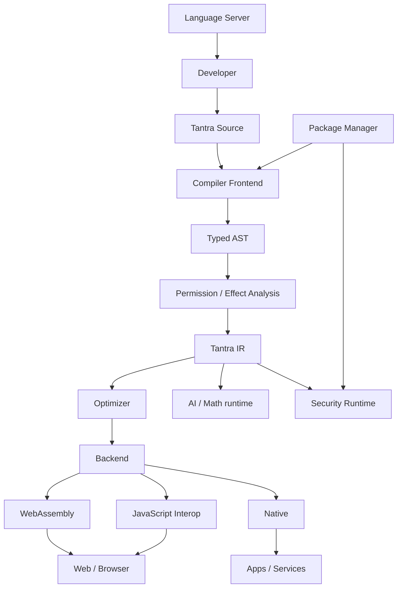

---

# 102. Security-Centered Architecture Chart

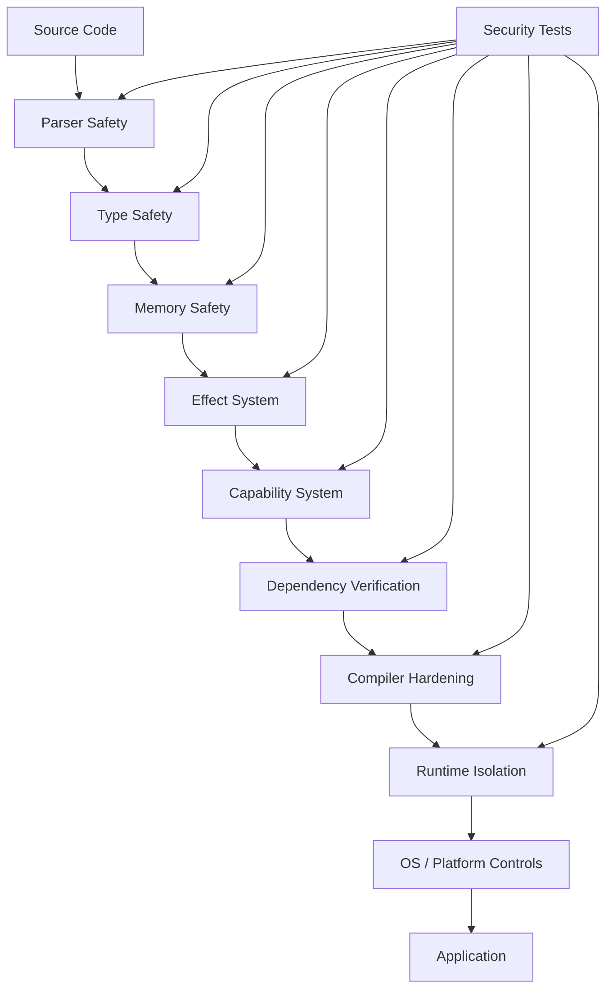

---

# 103. Ecosystem Map

```text
                         TANTRA ECOSYSTEM

                           ┌─────────┐
                           │ Language│
                           └────┬────┘
                                │
       ┌────────────────────────┼────────────────────────┐
       │                        │                        │
   Compiler                  Runtime                  Tooling
       │                        │                        │
  ┌────┼────┐          ┌───────┼───────┐        ┌──────┼─────┐
  │    │    │          │       │       │        │      │     │
 Wasm  JS  Native     Memory  Async  Security  LSP  CLI  Format

       ┌────────────────────────┼────────────────────────┐
       │                        │                        │
      UI                      Data                    AI/Math
       │                        │                        │
   Web/Apps               DB/Network             Tensor/Models

                        │
                 Package Ecosystem
                        │
            Registry + Signatures + Lock
```

---

# 104. Open Questions Before Coding

These questions must be formally decided:

1. Exact Sanskrit keyword set.
2. Devanagari-only, ASCII-only, or dual syntax.
3. File extension confirmation.
4. Type system details.
5. Ownership vs GC vs hybrid memory model.
6. Effect system syntax.
7. Capability syntax.
8. Error handling model.
9. Generic type syntax.
10. Macro/metaprogramming policy.
11. Reflection policy.
12. FFI policy.
13. Async/concurrency model.
14. Wasm runtime choice.
15. Native backend strategy.
16. Bootstrap implementation language.
17. Package registry model.
18. License.
19. Governance model.
20. Trademark/domain strategy.

These should be resolved in RFCs, not by accidental implementation decisions.

---

# 105. Important Risks

| Risk | Impact | Mitigation |
|---|---:|---|
| Scope becomes too large | Very high | phased roadmap |
| Security claims exceed evidence | Very high | evidence-based scorecards |
| Unicode ambiguity | High | strict identifier rules |
| Compiler complexity | High | IR + modular architecture |
| Ecosystem adoption | High | JS/web interoperability |
| Package supply-chain risk | Very high | signatures + lockfiles |
| Slow compiler | Medium | incremental compilation |
| Runtime bloat | Medium | modular runtime |
| Too many built-ins | Medium | small core + packages |
| Maintenance burden | High | monorepo + RFC governance |
| Lack of contributors | High | docs + beginner contribution paths |
| Overreliance on AI | High | human review + tests |

---

# 106. What “A1++++ Security” Should Mean in Tantra

Instead of a marketing grade, define measurable levels.

### Level S0
Basic language correctness.

### Level S1
Strong types + memory-safe baseline.

### Level S2
Capability-based security + safe defaults.

### Level S3
Package signing + reproducible builds + fuzzing.

### Level S4
Independent audit + public vulnerability process.

### Level S5
Formal verification for selected critical components + mature ecosystem evidence.

A project can publish its current verified level.

This is much more meaningful than a decorative “A1++++” label.

---

# 107. What “Fast” Should Mean

Define measurable targets instead of vague statements:

```text
Fast build
Fast startup
Fast UI updates
Fast server handling
Fast numerical code
Small output
Low memory overhead
```

Each requires separate measurements.

---

# 108. Final Architecture Recommendation

The recommended final conceptual architecture is:

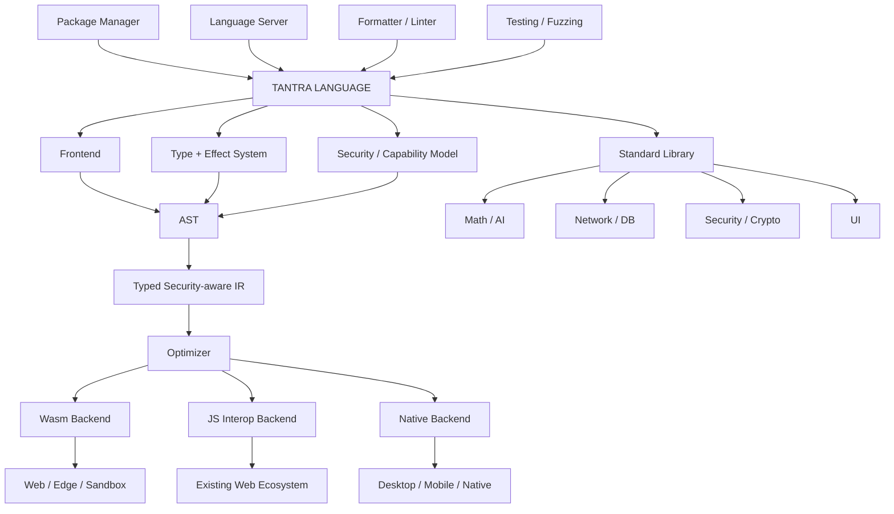

---

# 109. Final Project Principle

Tantra should aim to make this possible:

```text
ONE DEVELOPER-FACING LANGUAGE
        ↓
ONE COHERENT TYPE SYSTEM
        ↓
ONE SECURITY MODEL
        ↓
ONE PACKAGE MODEL
        ↓
ONE TOOLCHAIN
        ↓
MULTIPLE DEPLOYMENT TARGETS
```

Not:

```text
Tantra
   ↓
pretend to be React
   ↓
pretend to be TypeScript
   ↓
pretend to be CSS
   ↓
pretend to be HTML
```

Instead:

> **Tantra should have its own semantics and compiler architecture, while interoperating with existing technologies where practical.**

---

# 110. Immediate Next Step

The next engineering artifact should be:

## `TANTRA_LANGUAGE_SPEC_V0.1.md`

It should freeze, in exact detail:

- keywords
- syntax
- grammar (EBNF/PEG-style)
- types
- functions
- variables
- modules
- errors
- generics
- async
- permissions
- memory model
- Unicode policy
- naming rules
- comments
- literals
- operators
- precedence
- standard-library conventions
- sample programs

Only after that should the first compiler implementation begin.

---

# 111. Final Decision Summary

| Decision | Current blueprint decision |
|---|---|
| Language name | **Tantra** |
| Primary identity | Sanskrit-inspired |
| Main goal | General-purpose secure software development |
| UI | First-class future subsystem |
| Backend | Same core language |
| Web | First major target |
| HTML/CSS/React | Interop/deployment technologies, not mandatory authoring languages |
| Vite | Not a language; may be unnecessary in a mature Tantra toolchain |
| TypeScript | Not required for Tantra source |
| Compiler | Essential |
| WebAssembly | Early target |
| Native | Later target |
| AI/math | In scope |
| Browser extensions | In scope later |
| Games | Not first-party initial scope |
| Security | Core architectural principle |
| Domain | Buy only after branding/availability checks |
| Hardware | Normal modern computer to start |
| Expensive servers | Not required initially |
| Cloud | Use only when compute/CI needs grow |
| Cost strategy | Free/open-source first |
| GitHub | Source, CI, releases, community |
| Vercel | Deployment target for compatible web output |
| Self-hosting compiler | Long-term milestone |
| Publicity | After working, measurable prototype |

---

# 112. Final Vision Statement

**Tantra** should become a programming environment where the developer writes software in one coherent language, while the toolchain handles the platform-specific complexity underneath.

Its strongest differentiator should not simply be that the keywords are Sanskrit-inspired. Its differentiator should be the combination of:

```text
Sanskrit-inspired identity
+
Modern language design
+
Strong type safety
+
Capability-based security
+
Memory-safe foundations
+
Secure package supply chain
+
Compiler-driven optimization
+
First-class web/UI support
+
AI/math support
+
Cross-platform compilation
+
Excellent developer tooling
+
Open-source transparency
```

The project should grow from a tiny, correct compiler into a mature ecosystem rather than attempting to build everything simultaneously.

---

# Appendix A — One-Page Flow Chart

```text
                         ┌────────────────────┐
                         │     TANTRA CODE    │
                         │      .tantra       │
                         └─────────┬──────────┘
                                   ↓
                         ┌────────────────────┐
                         │ Lexer / Parser     │
                         └─────────┬──────────┘
                                   ↓
                         ┌────────────────────┐
                         │ AST + Type System  │
                         └─────────┬──────────┘
                                   ↓
                         ┌────────────────────┐
                         │ Security / Effects │
                         │ / Capabilities     │
                         └─────────┬──────────┘
                                   ↓
                         ┌────────────────────┐
                         │ Tantra IR          │
                         └─────────┬──────────┘
                                   ↓
                         ┌────────────────────┐
                         │ Optimizer          │
                         └─────────┬──────────┘
                                   ↓
                    ┌──────────────┼──────────────┐
                    ↓              ↓              ↓
                 WASM          JS Interop       Native
                    ↓              ↓              ↓
                 Web/UI       Existing Web    Apps/Services
                    │
                    └──────────────┬──────────────┘
                                   ↓
                        Security + Runtime + Stdlib
                                   ↓
                           Real Applications
```

---

# Appendix B — Tantra Success Criteria

The project should be considered successful progressively, not all at once.

### Prototype success

- language parses
- simple programs execute
- errors work

### Alpha success

- typed core
- tests
- modules
- basic security model

### Beta success

- stable web target
- useful tooling
- package system
- security testing

### Production success

- real applications
- reproducible builds
- security audit
- mature documentation
- ecosystem adoption

### Long-term success

- self-hosting
- stable language governance
- third-party libraries
- independent developers building applications with Tantra

---

# Appendix C — Core Principle to Keep Throughout the Project

> **Tantra is not successful because it replaces every existing technology on day one. Tantra is successful when it provides a coherent, secure and practical path for developers to build real software with substantially less accidental complexity.**

---

**End of TANTRA Blueprint**

---

# TANTRA MASTER-BLUEPRINT REVISION — MISSED/EXPANDED REQUIREMENTS

આ revision existing blueprintમાંથી કંઈ કાઢતું નથી. નીચેના requirements explicitly ઉમેરવામાં આવ્યા છે જેથી projectની scope વધુ complete રહે.

## A. Universal Capability Goal

Tantraનું long-term target માત્ર web/app language નહીં પરંતુ general-purpose computing platform છે. Modern general-purpose languages જે major કામ કરી શકે છે તે બધું Tantraમાં શક્ય બનાવવાનું design goal રહેશે, subject to platform/hardware limitations.

આમાં વધુમાં:

- operating-system utilities
- command-line tools
- compilers/interpreters
- servers
- APIs
- desktop software
- mobile software
- browser extensions
- automation
- scripting
- data processing
- scientific computing
- simulations
- embedded/IoT software (long-term)
- real-time software (long-term)
- distributed systems
- cloud services
- cryptographic software
- graphics applications
- visualization
- CAD-like computational workloads (through libraries)
- multimedia processing
- audio processing
- image/video processing
- compression
- parsing/compilers
- databases and database tooling
- developer tools
- AI/ML systems

નોંધ: દરેક target માટે અલગ backend/runtime/SDKની જરૂર પડી શકે છે; એક જ executable representation દરેક platform પર સમાન રીતે ચાલશે એવી ધારણા રાખવી નહીં.

## B. Multimedia System

Tantraમાં future multimedia subsystem માટે:

```text
Multimedia
   |
   +-- Image
   |    +-- decode/encode
   |    +-- resize
   |    +-- transform
   |    +-- filters
   |
   +-- Audio
   |    +-- playback
   |    +-- recording
   |    +-- DSP
   |    +-- streaming
   |
   +-- Video
   |    +-- decode/encode adapters
   |    +-- frames
   |    +-- effects
   |    +-- streaming
   |
   +-- Graphics
        +-- 1D
        +-- 2D
        +-- 3D
        +-- animation
        +-- VFX
```

Untrusted multimedia files must be treated as security-sensitive input and fuzz-tested.

## C. Audio

Third-party developers should eventually be able to create:

- music applications
- audio players
- sound-processing tools
- synthesizers
- voice applications
- audio visualizers
- games with audio

Potential capabilities:

- PCM
- streaming
- mixing
- effects
- filters
- FFT/DSP libraries
- microphone APIs
- secure device permissions

## D. Image and Video Processing

Potential libraries:

- image transformations
- color spaces
- filters
- compositing
- metadata handling
- frame processing
- video pipeline abstractions
- hardware acceleration adapters

Security limits must protect against decompression bombs and malicious media files.

## E. Compiler Diagnostics — Advanced Design

Diagnostics should support:

1. Error code.
2. Error category.
3. Exact source location.
4. Primary span.
5. Secondary spans.
6. Explanation.
7. Expected vs found.
8. Suggested correction.
9. Confidence of suggestion.
10. Related documentation.
11. Security implications where relevant.
12. Machine-readable JSON diagnostics.
13. IDE/LSP diagnostics.
14. Terminal-friendly diagnostics.
15. Localization support for explanations.

Example machine-readable form:

```json
{
  "code": "E3017",
  "category": "type",
  "severity": "error",
  "file": "src/main.tn",
  "line": 42,
  "column": 9,
  "expected": "Integer",
  "found": "Text",
  "message": "Integer value required",
  "suggestion": "Convert the value explicitly"
}
```

## F. Security Diagnostics Must Be First-Class

Security problems should not look like ordinary style warnings.

Example:

```text
TANTRA S5012 — Security Error

Capability denied: network.connect

The current module has:
    filesystem.read

It does not have:
    network.connect

Reason:
Tantra prevents a module from silently obtaining network access.

Suggested action:
Declare the capability only if the application genuinely requires it.
```

## G. Static Analysis Engine

A dedicated analysis engine should eventually detect:

- suspicious data flows
- tainted input
- unsafe sinks
- injection paths
- hard-coded secrets
- insecure randomness
- unsafe deserialization
- path traversal patterns
- command injection patterns
- unsafe native calls
- privilege escalation patterns
- missing authentication/authorization checks where detectable
- dangerous configuration
- dependency risks

Static analysis should be conservative and explain false-positive possibilities rather than pretending perfect detection.

## H. Taint/Data-Flow Model

Long-term architecture:

```text
Untrusted Input
      |
      v
  Taint Source
      |
      v
  Data Flow Graph
      |
      +---- safe validation ----> sanitized
      |
      v
Sensitive Sink
      |
      v
Security diagnostic / block
```

This can become a major differentiator of the security tooling.

## I. Secret Management

Tantra tooling should detect probable secrets in source and build artifacts.

Potential integrations:

- OS keychain
- cloud secret managers
- environment variables
- hardware-backed key stores

The compiler should warn or block obvious accidental secret embedding depending on project policy.

## J. Privacy-First Runtime and Tooling

Tantra should have a local-first philosophy:

- ordinary compilation should happen locally
- source should not be uploaded by default
- telemetry should be opt-in or clearly configurable
- cloud AI should be explicit
- crash reports should minimize sensitive source/data
- package metadata should not reveal unnecessary private project information

## K. Capability Manifest

Every deployable application may eventually have a manifest such as:

```text
application:
    name: MyApp

capabilities:
    network: true
    filesystem.read: true
    filesystem.write: false
    camera: false
    microphone: false
    process: false
```

The exact syntax is not final.

## L. Permission Minimization

Tantra tooling should support a least-privilege workflow:

```text
Requested capabilities
        |
        v
Actual used capabilities
        |
        v
Remove unused permissions
        |
        v
Hardened application
```

A future `tantra permissions` command could inspect and explain capability use.

## M. Secure-by-Default UI

The UI framework should make common security-safe behavior the default.

Examples:

- safe text insertion
- escaped content
- safe URL APIs
- restricted HTML injection
- CSP helpers
- secure cookie helpers
- CSRF-safe forms
- accessibility-safe primitives

Explicit unsafe/raw APIs must be visibly marked.

## N. UI Architecture

```text
Tantra UI
   |
   +-- Components
   +-- Layout
   +-- State
   +-- Events
   +-- Styles
   +-- Accessibility
   +-- Localization
   +-- Animation
   +-- Graphics
   +-- Data binding
   |
   v
Rendering abstraction
   |
   +-- Browser
   +-- WebAssembly/WebGPU
   +-- Desktop
   +-- Mobile
   +-- Native
```

## O. Responsive and Adaptive UI

The UI system should eventually support:

- phone
- tablet
- desktop
- large display
- touch
- mouse
- keyboard
- stylus
- accessibility devices

without forcing developers to manually duplicate entire layouts.

## P. Design System

Tantra UI may eventually include:

- spacing system
- typography system
- component primitives
- theme tokens
- light/dark themes
- high-contrast mode
- responsive breakpoints
- motion preferences

Developers should also be able to build their own design systems.

## Q. Animation System — Expanded

Tantra should be capable of:

- property animation
- keyframes
- easing
- spring animation
- timeline sequencing
- parallel animations
- chained animations
- animation cancellation
- interpolation
- skeletal animation
- morph targets
- particle animation
- procedural animation
- physics-driven animation
- UI transitions
- scroll-linked animation

## R. 3D System — Expanded

Long-term 3D API should cover:

- scene graph
- entities/components
- transforms
- cameras
- lights
- materials
- textures
- meshes
- skeletal rigs
- animations
- particles
- shaders
- post-processing
- instancing
- level-of-detail
- culling
- asset pipelines
- GPU resource management

A full editor is optional and is not part of the initial language core.

## S. Shader Strategy

Graphics developers may need shader support.

Possible architecture:

```text
Tantra Graphics API
       |
       v
Shader abstraction
       |
 +-----+-----+
 |           |
 v           v
WebGPU      Native GPU APIs
```

Shader source should be validated and resource-limited where possible.

## T. Scientific and Engineering Computing

Long-term support should include:

- numerical linear algebra
- differential equations
- statistics
- signal processing
- optimization
- simulation
- data analysis
- scientific visualization

## U. Distributed Systems

Tantra should eventually support:

- service-to-service communication
- message queues
- RPC abstractions
- distributed tracing
- retries
- circuit breakers
- idempotency helpers
- service authentication
- secure serialization

## V. Cloud/Serverless Targets

Tantra should eventually provide deployment adapters for different platforms rather than tying the language to one vendor.

Possible output classes:

```text
Tantra
  |
  +-- long-running server
  +-- container
  +-- WebAssembly service
  +-- serverless function
  +-- static web application
```

## W. Build Graph

The build system should understand dependencies rather than simply compile every file every time.

```text
Source files
     |
     v
Dependency graph
     |
     +--> unchanged nodes = cached
     |
     +--> changed nodes = rebuilt
     |
     v
Incremental artifact graph
```

This improves large-project build speed.

## X. Caching

Potential caches:

- parser cache
- type-check cache
- IR cache
- dependency cache
- package cache
- build artifact cache

Cache integrity must be verified; corrupted/untrusted cache data must not bypass security checks.

## Y. Deterministic Tooling

Where practical, compiler and formatter output should be deterministic.

This improves:

- debugging
- reproducibility
- CI
- security review
- collaboration

## Z. Testing Matrix

Tantra should eventually test across:

| Dimension | Examples |
|---|---|
| OS | Windows, Linux, macOS |
| Architecture | x86_64, ARM64 |
| Target | Web, Wasm, native |
| Build | debug, release |
| Runtime | supported runtime versions |
| Locale | Unicode/localization cases |
| Input | valid, malformed, hostile |
| Package state | clean, cached, corrupted |

Exact supported platform matrix should be decided later.

## AA. Compiler Correctness

Compiler bugs can generate incorrect software even when source code is correct.

Therefore:

- differential testing
- IR validation
- backend validation
- compiler fuzzing
- randomized program generation
- optimization equivalence tests
- regression suite

should be part of the long-term compiler QA system.

## AB. Differential Testing

For selected semantics, compare multiple implementations or execution modes:

```text
Tantra source
   |
   +--> interpreter/reference implementation
   |
   +--> optimized compiler
   |
   +--> alternative backend
   |
   v
Compare observable behavior
```

This can detect compiler miscompilations.

## AC. Reference Interpreter

A simple reference interpreter may be valuable early in development because it provides a semantic oracle against which the optimizing compiler can be tested.

## AD. Compatibility Layer

Tantra should not force immediate abandonment of existing technologies.

Potential interoperability:

```text
Tantra <-> JavaScript
Tantra <-> WebAssembly
Tantra <-> C ABI
Tantra <-> platform APIs
Tantra <-> existing databases
Tantra <-> existing web services
```

## AE. Package Registry Security

Registry architecture should consider:

- namespace squatting
- dependency confusion
- typosquatting
- malicious uploads
- compromised maintainer accounts
- package takeover
- yanked releases
- immutable release identifiers

Potential defenses:

- publisher verification
- namespace rules
- signing
- 2FA for publishers
- provenance
- malware scanning
- security advisories

## AF. CI/CD Security

Official Tantra CI should follow least privilege:

- minimal tokens
- protected release branches
- signed artifacts
- isolated build jobs
- pinned dependencies where practical
- provenance generation
- release approvals

## AG. Release Channels

Potential channels:

```text
nightly -> experimental -> beta -> stable -> LTS
```

Each channel should have documented stability/security expectations.

## AH. LTS

If Tantra becomes widely used, an LTS release line can provide security fixes without forcing immediate feature upgrades.

## AI. API Design Principle

The standard library should prefer high-level safe APIs for ordinary use while retaining low-level APIs for advanced users.

Example concept:

```text
safe_database_query(...)
```

should be easier than manually constructing unsafe query strings.

## AJ. Resource Limits in Untrusted Code

Sandboxed code may require limits on:

- CPU
- memory
- execution time
- recursion
- file size
- network connections
- output size

This is important for plugin systems and user-supplied code.

## AK. Plugin Architecture

Tantra itself may eventually support plugins/extensions with explicit capability manifests.

```text
Plugin
  |
  +-- metadata
  +-- requested capabilities
  +-- signed artifact
  +-- version
  +-- compatibility range
```

## AL. AI Plugin Security

AI-related plugins/models should be treated as untrusted inputs unless verified.

Model files, datasets and tools can be attack surfaces.

## AM. Developer Experience Goal

The developer workflow should feel like:

```text
Create project
      |
      v
Write Tantra
      |
      v
Run
      |
      +--> error? precise explanation
      |
      +--> security issue? precise security explanation
      |
      +--> success
      |
      v
Test
      |
      v
Audit
      |
      v
Build
      |
      v
Deploy
```

## AN. Final Expanded Principle

Tantra should aim to be capable enough that a developer does not have to select a different programming language merely because the project changed from UI to backend, mathematics, AI, graphics, automation, extension development or systems work.

However, this does not mean every platform-specific capability must be built into the language core. The correct architecture is:

**one language + strong compiler + secure runtime + standard library + specialized official modules + platform backends + interoperability.**

That keeps Tantra coherent while still allowing it to cover a very broad portion of modern software development.

---

# END — EXPANDED TANTRA MASTER BLUEPRINT
